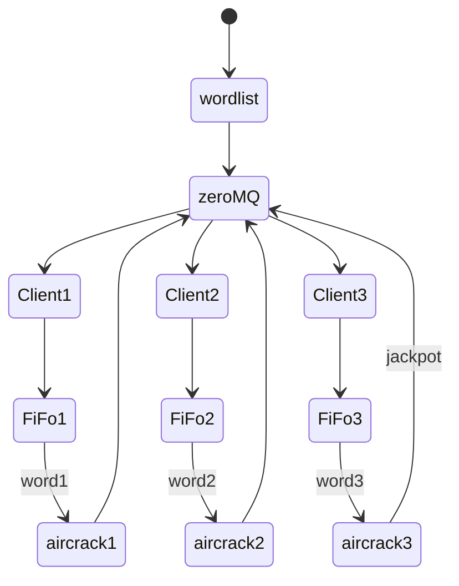

# The idea
basically it's p2pool but for aircrack-ng

```mermaid
  stateDiagram-v2
  [*] --> wordlist
  wordlist --> zeroMQ
  zeroMQ --> Client1
  zeroMQ --> Client2
  zeroMQ --> Client3
  Client1 --> FiFo1
  Client2 --> FiFo2
  Client3 --> FiFo3
  FiFo1 --> aircrack1: word1
  FiFo2 --> aircrack2: word2
  FiFo3 --> aircrack3: word3
  aircrack1 --> zeroMQ
  aircrack2 --> zeroMQ
  aircrack3 --> zeroMQ: jackpot
```
